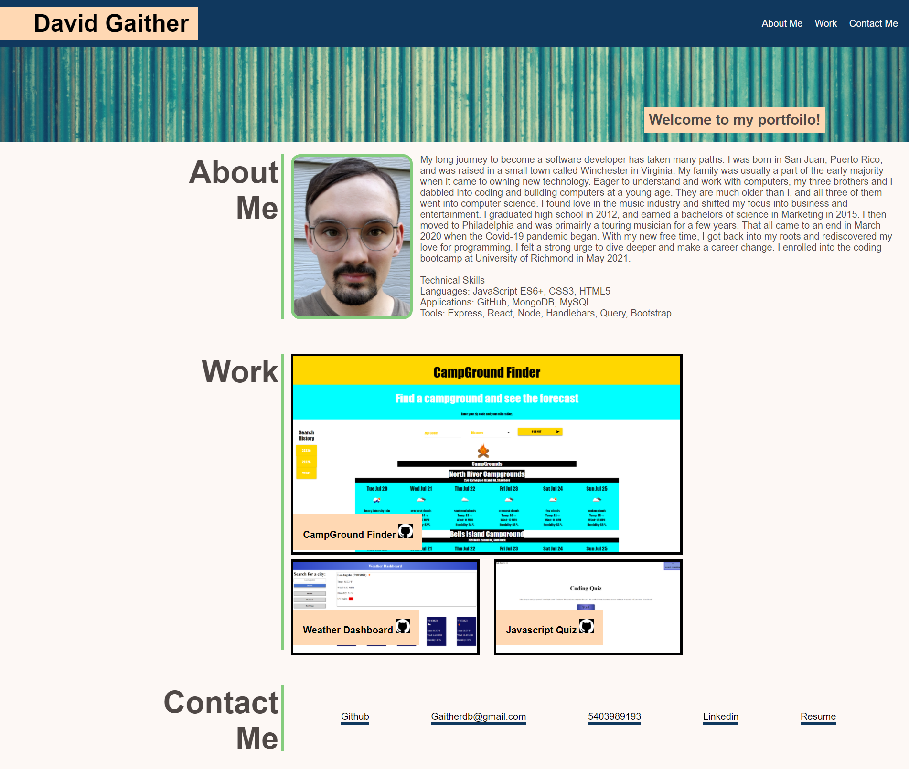

# My Portfolio

This is an update to my portfoilo

## Functionality

This webpage acts as a portfolio for myself, David Gaither. 

It includes three sections: About Me, Work, & Contact Me. 
The nav bar links allow you to automatically scroll to the desired section. 

The Work section provides images representing coding projects that I have worked on.
The first and larger image, CampGround Finder, links to my first group project when the image is clicked.
The other images can be clicked to be directed to their respective live pages as well. 
Clicking the title cards on the images directs you to the github repoistory for that piece of work.

The Contact Me section has a list of links that allow you to contact me and allows you to view personal webpages that represent me.

## Additional Info

Deployed [Portfolio](https://gaitherdb.github.io/Portfolio2/) site on Github.

* This webpage was made using flexboxes and flex properties to help position the content and to help it adjust to different media screen sizes.
* Media screen sizes adjust according to these sizes: 992px+, 577px - 991px, & 576px and below. 
* Some text and images highlight when hovered.
* Alt tags are provided for images to help users that use disability extentions.

**Version 1.0**

